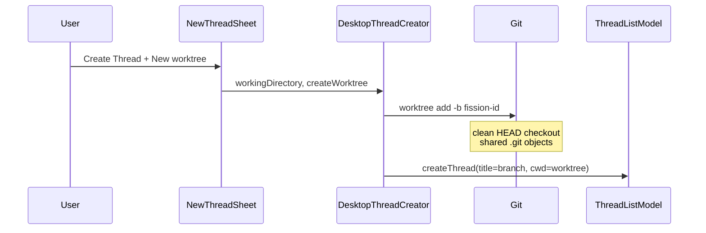
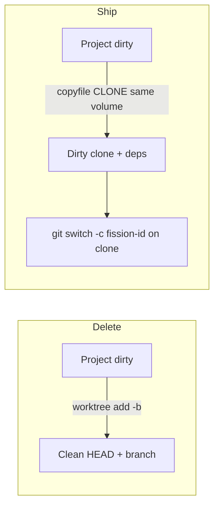

# Replacing Git worktrees with Rift (or a Fission spin)

**Status:** decision
**Current as of / sources accessed:** 2026-09-13
**Constraint:** no Git worktrees. Isolation is copy-on-write only. Fail closed if CoW cannot run.
**Scope:** Desktop Thread isolation today (`git worktree add -b`) vs [anomalyco/rift](https://github.com/anomalyco/rift) vs a Fission-owned APFS isolator.

## Decision

**Delete the worktree feature.** Isolation becomes an APFS copy-on-write clone of the live project directory, owned by Fission Desktop. Do not vendor Rift. Do not keep `git worktree` as a fallback, hybrid, or labeled option.

Engine: `copyfile(3)` with `COPYFILE_RECURSIVE | COPYFILE_CLONE` (not directory `clonefile(2)`, not Rift, not `git worktree add --reflink`). Storage: sibling of the project root, same volume. Git after clone: independent cloned `.git`, then `git switch -c fission-<id>` with no reset. Copy everything, including `node_modules`. Delete the clone when the Thread is settled. If the volume cannot clone, error — do not silently check out a clean tree.

Rift is the right *idea* (dirty snapshot in <0.1s, deps CoW-shared until write). It is the wrong *binary*: experimental `0.0.10`, mutates the source via `init`, directory `clonefile`, detached HEAD, hooks, refuse-linked-worktrees, Bun/Node FFI, open trash/registry bugs. Reimplement the APFS path in Swift and bind lifecycle to Thread.

## Locked choices

| Question | Choice | Why |
|---|---|---|
| Engine | Fission `copyfile` clone, not Rift, not worktrees | Same-volume CoW without experimental dep, without `init`/hooks, without Apple-discouraged dir `clonefile` |
| Worktree fallback | **None.** Fail if not APFS / cross-volume / clone fails | A fallback would reintroduce clean-HEAD checkouts and Git-only isolation — the thing we are deleting |
| Reflink-worktree hybrid | **No** | Still a worktree: shared gitdir, clean or half-dirty tree, `node_modules` missing |
| What gets copied | **All files** (dirty, untracked, ignored, deps) | CoW makes this cheap; skipping artifacts recreates the worktree "agent must install" tax |
| Where it lives | `<projectParent>/.fission/<project>/<thread-id>/` | Must be same volume as source or CoW is a lie; `~/.fission/worktrees` breaks for external disks |
| Git after clone | `git switch -c fission-<id>` on the **clone only** | Independent repo (not a worktree). Unique branch so agents can push/PR without moving source `main`. Working tree stays dirty |
| Linked Git worktree as source | **Refuse** | `.git` is a `gitdir:` file; cloning it shares the source index |
| Non-git folders | **Allowed** | CoW does not need Git; title falls back to `"local"` / folder name as today |
| Isolate vs in-place | Keep the toggle, rename off "worktree", **default on** | Instant CoW removes the reason to default off; in-place remains for "agent, edit this folder" |
| Settle | **Delete the isolate directory** | Clones are Thread-owned. Reopen before settle keeps the files. No `git worktree remove` |
| Orphan `~/.fission/worktrees` | Leave on disk; do not auto-`worktree remove` in v1 | Separate cleanup. New creates never write there |
| UI copy | "New isolated workspace" (or "Isolate") | Stop saying worktree |

## Compact decision matrix

| Option | Isolation model | Git semantics | Disk / speed | Decision |
|---|---|---|---|---|
| **`git worktree add -b`** | Clean `HEAD` checkout | Linked worktree + unique branch | Cheap objects; no deps; no dirty files | **Delete** |
| **Rift CLI / FFI** | CoW snapshot of live tree | Cloned `.git`, detached HEAD | Instant same-volume; default skips deps | **Do not vendor** |
| **Worktree + reflink** | Still a worktree | Shared gitdir + branch | CoW of matching blobs; deps missing | **No** |
| **Fission APFS isolator** | `copyfile` clone of live tree | Cloned `.git` + `switch -c` | Instant same-volume; deps included | **This** |

## What Fission does today

Create path is Desktop-only. Core stores `workingDirectory` as an opaque string.

```text
NewThreadSheet
  Toggle "New worktree"  (@AppStorage createThreadsInNewWorktree)
    → ThreadListView.createThread(in:createWorktree:)
      → DesktopThreadCreator.create
           git rev-parse --show-toplevel
           git worktree add -b fission-<6char> ~/.fission/worktrees/<repo>/<branch>
           Thread.workingDirectory = worktree + relative subpath
           Thread.title = GitBranchResolver.currentBranch  // fission-<id>
```

Facts that matter for a replacement:

- Isolation is **opt-in**, persisted in AppStorage, default off.
- Worktree **requires a Git repository**. Non-git folders cannot isolate.
- New worktree is a **clean checkout**. Dirty/untracked files stay in the source folder.
- Branch names are random `fission-<id>`; collisions retry.
- Title is the current branch (or 7-char SHA if detached).
- Settle **does not** `git worktree remove`. Isolates accumulate under `~/.fission/worktrees`.
- `GitBranchResolver` already understands linked worktrees (`.git` file → `gitdir:`).
- Terminals `chdir` into `thread.workingDirectory`. Isolation is entirely "which directory is the PTY in".
- Mobile does not create worktrees.



## What Rift actually is

Rift is a Rust workspace (`crates/core`, `crates/cli`, `crates/ffi`) sold as a "better alternative to git worktrees". Core operations: `init`, `create`, `remove`, `list`, `ancestors`, `gc`. Metadata is a user-level SQLite registry plus a `.rift` ULID marker in each workspace.

### Copy backends

| Platform | Exact `create` (`copyAll`) | Filtered `create` (default) |
|---|---|---|
| macOS APFS | `clonefile(src, dst, 0)` on the whole tree | Walk + per-file `clonefile`; skip artifact dirs |
| Linux btrfs | Writable subvolume snapshot | Reflink import into a new subvolume |
| Linux XFS / FICLONE | Per-file `FICLONE` | Same, with exclusions |
| Windows | Not implemented | Not implemented |

Default filtered exclusions (any depth): `node_modules`, `target`, venvs, `__pycache__`, `.next`, `dist`, `build`, `coverage`, and similar. Manifests/lockfiles stay. `--copy-all` keeps everything.

Default layout (sibling of the *registered source*, so CoW stays on the same volume):

```text
~/code/app/                      source (after rift init)
~/code/.rifts/app/parser-fix/    created workspace
~/code/.rifts/app/.trash/        removed storage
```

### Git, as specified

Git is an *integration*, not the model. Creating from a repo:

- Copies `.git` with the tree (independent object store at CoW until mutation/repack).
- Detaches `HEAD` at the same commit; **does not create a branch**.
- Keeps index + dirty + untracked + ignored (except filtered artifacts).
- Adds `/.rift` to `.git/info/exclude` on the source.
- **Refuses** linked worktrees, in-progress merge/rebase/cherry-pick/revert/bisect, and index locks.

Plain directories work. That is a Fission gap: isolate a non-git project.

### Integration surfaces Fission could use

1. **CLI** `rift create --name … --into … --copy-all --no-hooks` — stdout path. Simplest spike.
2. **C FFI** `rift_ffi_call` / `rift_ffi_free` — JSON request/response. Built for Bun/experimental Node 26 FFI, not SwiftPM.
3. **Reimplement APFS path in Swift** — `copyfile(src, dst, nil, COPYFILE_RECURSIVE | COPYFILE_CLONE)`.

### Why not vendor it

Open issues on 2026-09-13 include: `remove --children` stranding data in `.trash` while SQLite still has active rows; concurrent same-name creates deleting the destination; `init` following a `.git` symlink and writing outside the workspace; `create --name .trash` producing an unremovable rift. That is not a lifecycle Fission should bind Thread settle to.

`rift init` is also a product footgun: Fission would have to convert every user project before first isolate, or fail with `initialization_required`. On btrfs that conversion is a live directory swap.

## Semantic gap (this is the real decision)

Git worktree and Rift are not interchangeable implementations of one feature. They isolate *different things*.

```text
Source project (dirty, node_modules present)
├─ Fission worktree today
│  ├─ files: committed HEAD only
│  ├─ git: linked worktree, new branch fission-id, shared objects
│  └─ deps: missing → agent must install
└─ Rift / CoW snapshot
   ├─ files: exact live tree (or tree minus artifact dirs)
   ├─ git: cloned .git, detached HEAD, independent refs
   └─ deps: present if copy-all; else missing + optional postcreate install
```

For parallel **Threads** (Fission's unit of agent work), the CoW snapshot is usually what users mean by "don't touch my folder":

- Agent sees the user's uncommitted work.
- Two Threads forked from the same dirty tree diverge independently.
- `node_modules` can be CoW-shared until someone writes into them (huge vs worktree + `pnpm i`).
- Source folder is never the agent's cwd.

Costs of that model:

- **Not a Git worktree.** `git worktree list` will not show it. Fetch in the source does not update the isolate's objects until the isolate fetches.
- **Detached HEAD** (Rift) makes `git push -u` / PR agents fail until they create a branch. Fission today *is* that branch. A spin should create `fission-<id>` on the clone **without** `reset --hard`.
- **Same-volume CoW.** `~/.fission/worktrees` on the home volume will *byte-copy* (or fail, if we refuse fallback) when the project lives on an external APFS volume. Sibling `../.rifts/<project>/` (Rift's default) is the correct default storage.
- **Apple `clonefile` on directories.** Rift's fast path does what Apple discourages (locks the source hierarchy). Fission should use recursive `copyfile` clone: slightly more syscalls, no kernel stall risk.



## Shape to ship

Isolation is Desktop-only. Core still stores `workingDirectory` as a path. The PTY `chdir`s there. No new Core entity until Mobile needs it.

```text
create Thread
  if isolate off → cwd = selected folder
  if isolate on
    root = git toplevel or selected folder
    refuse if root/.git is a file          # linked worktree
    dest = <parent>/.fission/<name>/<thread-id>/
    probe same APFS volume + clonefile of a temp file
    copyfile(root, dest, RECURSIVE|CLONE)
    if dest/.git is a dir → git switch -c fission-<id>
    cwd = dest + relative subpath
    title = branch or "local"
settle Thread
  kill PTYs
  delete dest
```

`git switch -c` (not `checkout -B`, not `reset --hard`): new branch at current HEAD, dirty index and files stay. Retry `<id>` on name collision. Source repo is never a Git worktree and never gets a new branch.

Probe CoW **before** the recursive copy. `COPYFILE_CLONE` falls back to byte-copy per file; that would look like success and fill the disk. If probe fails: "Project must be on APFS on the same volume as its isolate" — no worktree, no `cp -R`.

Do not put isolates under `~/.fission/` unless that path is the same volume as the project (home-dir projects). Sibling `.fission/` is the rule so an external SSD project stays CoW.

### Why not Rift's extras

- No `.rift` markers / user-level SQLite registry — Thread SQLite already owns identity.
- No `init` that converts the user's directory.
- No `.rift.toml` hooks.
- No detached HEAD.
- No directory-level `clonefile(2)`.
- No Linux backends until Desktop is not macOS-only.

### Swift seam

```text
Apps/Desktop/Sources/Threads/
├── DesktopThreadCreator.swift   # in-place vs isolate; errors to model
└── ProjectIsolator.swift        # volume probe, copyfile clone, switch -c, delete
```

Delete `git worktree add` and `~/.fission/worktrees` from the create path. Rename `createWorktree` → `createIsolate` through sheet, creator, tests, UITest ids.

Tests: dirty + untracked file survive; source unchanged; clone `HEAD` is `fission-<id>`; source still on original branch; linked worktree source errors; settle removes dest. Skip clone tests only if the runner volume cannot `clonefile`.

## Replacement impact map

| Surface | Change |
|---|---|
| `NewThreadSheet` | Toggle "New isolated workspace", default on, new help text |
| `DesktopThreadCreator` | `copyfile` + `switch -c`; drop `worktree add` |
| `GitBranchResolver` | Unchanged if we always create a branch on git clones |
| Settle | After PTY teardown, delete isolate dir |
| `~/.fission/worktrees` | Unused by new creates |
| UITests / a11y | Rename worktree control id |
| Non-git projects | Isolation works |
| Network / non-APFS / other volume | Create fails with CoW error |

## Unresolved

None that block the replacement. Optional later: skip-artifact clone mode, isolate-from-isolate (fork a Thread's clone), one-shot orphan worktree cleanup.
