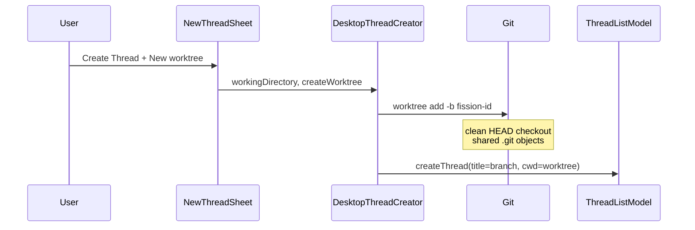
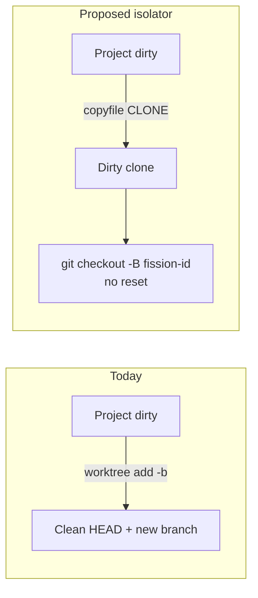

# Replacing Git worktrees with Rift (or a Fission spin)

**Status:** recommendation research
**Current as of / sources accessed:** 2026-09-13
**Scope:** Desktop Thread isolation today (`git worktree add -b`), vs [anomalyco/rift](https://github.com/anomalyco/rift) (`dev`, v0.0.10), vs a Fission-owned copy-on-write isolator. Not an implementation plan for shipping Rift.

## Executive recommendation

**Do not replace Fission's isolator with upstream Rift as a product dependency.** Steal the isolation *model* (APFS copy-on-write snapshot of the live project directory, including dirty files) and implement a thin Fission-owned isolator in Desktop. Keep Thread lifecycle, storage, and Git branch policy in Fission.

Rift is the right *idea* for parallel agents: CoW clone of the working tree in well under a second, dirty/untracked state preserved, `node_modules` optionally skipped. It is the wrong *dependency* for Fission Desktop:

- Marked experimental; crate version `0.0.10`; GitHub still has no SPDX license file (Cargo.toml says MIT).
- Last push 2026-08-14; open issues include registry/trash data-loss and concurrent-create races.
- `init` mutates the user's project (`.rift` marker, `.git/info/exclude`; on Linux btrfs it *replaces the directory with a subvolume*).
- Exact copies call `clonefile(2)` on the whole directory tree. Apple's `clonefile` man page and DTS discourage that; they want `copyfile(3)` + `COPYFILE_CLONE`.
- Git integration is a CoW-cloned independent `.git` plus detached `HEAD`. That fights Fission's current Thread title (`fission-<id>` branch) and PR/agent flows that expect a branch.
- Rift **refuses linked Git worktrees**, so today's Fission worktrees cannot be the source of a Rift create.
- Hooks run arbitrary commands from `.rift.toml`. Fission must not auto-run those.
- FFI is a JSON-in/JSON-out C ABI aimed at Bun/Node, not a Swift package. Bundling a Rust dylib into a universal hardened-runtime app is more work than the isolator itself.

**Keep Git worktrees only as a fallback** when CoW is unavailable (other volume, non-APFS, clone failure). Do not keep them as the default isolation mechanism: they check out a *clean* tree at `HEAD`, so the agent never sees uncommitted work, and they skip `node_modules` so every Thread pays an install.

## Compact decision matrix

| Option | Isolation model | Git semantics | Disk / speed | Fission fit | Decision |
|---|---|---|---|---|---|
| **Keep `git worktree add -b`** | Clean checkout of `HEAD`; unique branch; shared object store | Native worktree; title = branch | Cheap objects; full working-tree rewrite; no deps copied | Already shipped; no dirty-state; no settle cleanup | **Fallback only** |
| **Vendored / CLI Rift** | CoW snapshot of live tree; registry + trash | Independent cloned `.git`; detached HEAD; refuses worktrees | Instant on same APFS volume; default skips deps | Experimental; mutates source; hooks; Swift packaging cost | **No as dependency** |
| **`git worktree add --no-checkout` + reflink** ([git-cow-worktree](https://github.com/josharian/git-cow-worktree), proposed `git worktree add --reflink`) | Clean *or* partially dirty if you reflink then skip reset | Still a real Git worktree + branch | CoW of matching blobs; deps still missing unless extra copy | Preserves Git UX; still not a dirty-tree snapshot unless we skip `reset --hard` | **Optional later hybrid** |
| **Fission-owned APFS isolator** | `copyfile` recursive clone of project dir; store beside repo or under `~/.fission` | After clone: create `fission-<id>` on the *clone* without resetting; keep dirty files | Instant CoW on same volume; `copy-all` keeps `node_modules` | Matches Thread create/settle; no user-repo `init`; Swift-native | **Build this** |

## What Fission does today

Create path is Desktop-only. Core stores `workingDirectory` as an opaque string.

```text
NewThreadSheet
  Toggle "New worktree"  (@AppStorage createThreadsInNewWorktree)
    → ThreadListView.createThread(in:createWorktree:)
      → DesktopThreadCreator.create
           git rev-parse --show-toplevel
           git worktree add -b fission-<6char> ~/.fission/worktrees/<repo>/<branch>
           Thread.workingDirectory = worktree + relative subpath
           Thread.title = GitBranchResolver.currentBranch  // fission-<id>
```

Facts that matter for a replacement:

- Isolation is **opt-in**, persisted in AppStorage, default off.
- Worktree **requires a Git repository**. Non-git folders cannot isolate.
- New worktree is a **clean checkout**. Dirty/untracked files stay in the source folder.
- Branch names are random `fission-<id>`; collisions retry.
- Title is the current branch (or 7-char SHA if detached).
- Settle **does not** `git worktree remove`. Isolates accumulate under `~/.fission/worktrees`.
- `GitBranchResolver` already understands linked worktrees (`.git` file → `gitdir:`).
- Terminals `chdir` into `thread.workingDirectory`. Isolation is entirely "which directory is the PTY in".
- Mobile does not create worktrees.



## What Rift actually is

Rift is a Rust workspace (`crates/core`, `crates/cli`, `crates/ffi`) sold as a "better alternative to git worktrees". Core operations: `init`, `create`, `remove`, `list`, `ancestors`, `gc`. Metadata is a user-level SQLite registry plus a `.rift` ULID marker in each workspace.

### Copy backends

| Platform | Exact `create` (`copyAll`) | Filtered `create` (default) |
|---|---|---|
| macOS APFS | `clonefile(src, dst, 0)` on the whole tree | Walk + per-file `clonefile`; skip artifact dirs |
| Linux btrfs | Writable subvolume snapshot | Reflink import into a new subvolume |
| Linux XFS / FICLONE | Per-file `FICLONE` | Same, with exclusions |
| Windows | Not implemented | Not implemented |

Default filtered exclusions (any depth): `node_modules`, `target`, venvs, `__pycache__`, `.next`, `dist`, `build`, `coverage`, and similar. Manifests/lockfiles stay. `--copy-all` keeps everything.

Default layout (sibling of the *registered source*, so CoW stays on the same volume):

```text
~/code/app/                      source (after rift init)
~/code/.rifts/app/parser-fix/    created workspace
~/code/.rifts/app/.trash/        removed storage
```

### Git, as specified

Git is an *integration*, not the model. Creating from a repo:

- Copies `.git` with the tree (independent object store at CoW until mutation/repack).
- Detaches `HEAD` at the same commit; **does not create a branch**.
- Keeps index + dirty + untracked + ignored (except filtered artifacts).
- Adds `/.rift` to `.git/info/exclude` on the source.
- **Refuses** linked worktrees, in-progress merge/rebase/cherry-pick/revert/bisect, and index locks.

Plain directories work. That is a Fission gap: isolate a non-git project.

### Integration surfaces Fission could use

1. **CLI** `rift create --name … --into … --copy-all --no-hooks` — stdout path. Simplest spike.
2. **C FFI** `rift_ffi_call` / `rift_ffi_free` — JSON request/response. Built for Bun/experimental Node 26 FFI, not SwiftPM.
3. **Reimplement APFS path in Swift** — `copyfile(src, dst, nil, COPYFILE_RECURSIVE | COPYFILE_CLONE)`.

### Why not vendor it

Open issues on 2026-09-13 include: `remove --children` stranding data in `.trash` while SQLite still has active rows; concurrent same-name creates deleting the destination; `init` following a `.git` symlink and writing outside the workspace; `create --name .trash` producing an unremovable rift. That is not a lifecycle Fission should bind Thread settle to.

`rift init` is also a product footgun: Fission would have to convert every user project before first isolate, or fail with `initialization_required`. On btrfs that conversion is a live directory swap.

## Semantic gap (this is the real decision)

Git worktree and Rift are not interchangeable implementations of one feature. They isolate *different things*.

```text
Source project (dirty, node_modules present)
├─ Fission worktree today
│  ├─ files: committed HEAD only
│  ├─ git: linked worktree, new branch fission-id, shared objects
│  └─ deps: missing → agent must install
└─ Rift / CoW snapshot
   ├─ files: exact live tree (or tree minus artifact dirs)
   ├─ git: cloned .git, detached HEAD, independent refs
   └─ deps: present if copy-all; else missing + optional postcreate install
```

For parallel **Threads** (Fission's unit of agent work), the CoW snapshot is usually what users mean by "don't touch my folder":

- Agent sees the user's uncommitted work.
- Two Threads forked from the same dirty tree diverge independently.
- `node_modules` can be CoW-shared until someone writes into them (huge vs worktree + `pnpm i`).
- Source folder is never the agent's cwd.

Costs of that model:

- **Not a Git worktree.** `git worktree list` will not show it. Fetch in the source does not update the isolate's objects until the isolate fetches.
- **Detached HEAD** (Rift) makes `git push -u` / PR agents fail until they create a branch. Fission today *is* that branch. A spin should create `fission-<id>` on the clone **without** `reset --hard`.
- **Same-volume CoW.** `~/.fission/worktrees` on the home volume will *byte-copy* (or fail, if we refuse fallback) when the project lives on an external APFS volume. Sibling `../.rifts/<project>/` (Rift's default) is the correct default storage.
- **Apple `clonefile` on directories.** Rift's fast path does what Apple discourages (locks the source hierarchy). Fission should use recursive `copyfile` clone: slightly more syscalls, no kernel stall risk.



## Fission-owned spin (recommended shape)

Keep the product language in the UI honest: **New isolate** / **Isolated workspace**, not "New worktree", unless we keep the Git-worktree fallback as the labeled option.

### Create

1. Resolve project folder (same as today, including nested subpath).
2. If Git: `rev-parse --show-toplevel` for the clone root; remember relative subpath for cwd.
3. If not Git: clone the selected directory as the root.
4. Destination: same volume as source. Prefer `<parent>/.fission/<project>/<thread-id>/` (or `../.rifts/` if we want Rift-adjacent naming). Fall back to `~/.fission/isolates/…` only on the same volume.
5. `copyfile` recursive clone. Default **copy-all** for agent Threads so `node_modules` exists. Offer a later "skip artifacts" if create latency or disk accounting hurts.
6. If `.git` is a directory: `git checkout -B fission-<id>` in the clone (creates/resets the *ref* to current HEAD, working tree left dirty). If `.git` is a file (already a worktree): either refuse with a clear error, or clone by reading the real gitdir — do not pretend it is a Rift source.
7. Thread title = branch name (preserve today's UX) or project name if non-git.
8. Persist `workingDirectory` as clone + relative subpath. Optionally persist isolate root / backend in a later column; not required for v1 if path convention is stable.

### Settle / reopen

- Settle: terminate PTYs (already), then **trash** the isolate directory (move aside, then delete). Do not `git worktree remove` because it is not a worktree.
- Reopen: keep the isolate; do not delete until settle. If we want "keep the branch, drop the files", that is a later Git-worktree-only behavior.

### Fallback

If clone returns `EXDEV` / not APFS: either fail with "project must live on APFS next to isolates" or fall back to `git worktree add -b` (clean tree, Git-only). Fail closed for non-git + no CoW.

### What we deliberately drop from Rift

- Global SQLite registry and `.rift` markers in user repos.
- `init` conversion of the source tree.
- `.rift.toml` hooks.
- Ancestor trees of isolates (Thread already is the unit).
- Linux btrfs/XFS backends until Desktop is not macOS-only.
- Directory-level `clonefile(2)`.

### Swift seam

Stay in Desktop, same as `DesktopThreadCreator`:

```text
Apps/Desktop/Sources/Threads/
├── DesktopThreadCreator.swift     # orchestrates isolate vs in-place
└── ProjectIsolator.swift          # copyfile clone + optional git checkout -B
```

Core keeps `workingDirectory: String?`. Isolation is a Desktop adapter, not a domain entity, until Mobile/Server need it.

Tests: temp APFS dir, clone preserves dirty file + untracked file, `HEAD` is `fission-id`, source tree unchanged, settle deletes destination. Skip or stub if the test volume cannot clone.

### If we still want "use Rift"

Spike only, behind the same `ProjectIsolator` protocol:

```text
ProjectIsolator
  ├─ CopyfileIsolator      # production
  ├─ GitWorktreeIsolator   # fallback
  └─ RiftCLIIsolator       # spike: rift init/create --no-hooks --copy-all --into
```

Never call Rift hooks. Never `rift init` without an explicit user action. Treat CLI absence as "isolator unavailable".

## Replacement impact map

| Surface | Change if CoW isolator ships |
|---|---|
| `NewThreadSheet` toggle copy | "New isolated workspace" / help text: copies current files, leaves project folder untouched |
| `DesktopThreadCreator` | Swap `git worktree add` for isolator; keep identifier retry |
| `GitBranchResolver` | Detached HEAD would show SHA; avoid that by creating a branch on the clone |
| Settle | Must delete isolate (new); today's leak goes away |
| Existing `~/.fission/worktrees` | Orphan worktrees; one-shot `git worktree prune` / remove is a migration, not required to ship |
| UITests / a11y ids | `worktree toggle` identifier if we rename control |
| Non-git projects | Isolation becomes possible |
| Agents that `git push` | Still get a branch if we `checkout -B`; if we copy Rift's detach, they break |

## Unresolved questions

1. Isolate default on or still opt-in?
2. Copy-all (keep `node_modules`) or filtered + install?
3. Sibling `.fission/` vs `~/.fission/` when both same volume?
4. Fallback to Git worktree or fail when CoW unavailable?
5. Auto-delete isolate on settle, or keep until user trash?
6. Create branch on clone, or detached HEAD like Rift?
7. Allow isolating an existing Git worktree?
8. Rename UI off "worktree"?
